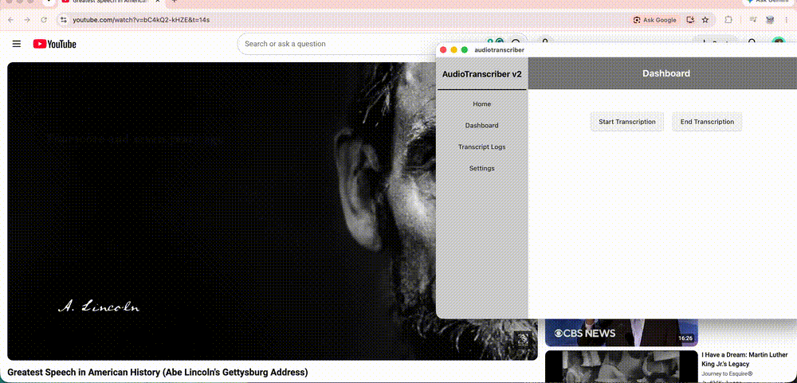

# AudioTranscriber

A macOS desktop app that captures audio from a selected window, application, or display and generates live captions locally.

Built with React, Tauri, Rust, Python, ScreenCaptureKit, WebSockets, and Faster Whisper.

> This project is currently macOS-only because it uses Apple's ScreenCaptureKit framework.

## Demo



## What it does

1. Choose a window, app, or display with the macOS system picker.
2. Capture its audio with ScreenCaptureKit.
3. Stream raw PCM audio from Rust to a local Python service.
4. Buffer and transcribe the audio with Faster Whisper.
5. Send transcript text back to Rust.
6. Display the text in an always-on-top caption overlay.

## Architecture

```text
React + Chakra UI
        |
        | Tauri commands
        v
Rust / Tauri backend
        |
        | ScreenCaptureKit captures PCM audio
        | WebSocket: ws://127.0.0.1:8765
        v
Python transcription service
        |
        | Faster Whisper transcribes buffered audio
        v
Rust caption handler
        |
        v
Always-on-top caption overlay
```

## Tech stack

- Frontend: React, TypeScript, Chakra UI, Vite
- Desktop runtime: Tauri v2
- Native backend: Rust
- macOS capture: ScreenCaptureKit
- Local communication: WebSockets
- Transcription: Python, Faster Whisper
- Audio format: 48 kHz stereo `f32le` PCM, converted to 16 kHz mono for Whisper

## Requirements

- macOS with Screen Recording permission enabled
- Xcode and Xcode Command Line Tools
- Rust and Cargo
- Node.js and npm
- Python virtual environment with the Python dependencies installed

## Installation

Clone the repository:

```bash
git clone <your-repository-url>
cd audiotranscriber
```

Install frontend and Rust dependencies:

```bash
npm install
```

Create and activate a Python environment:

```bash
python3 -m venv .venv
source .venv/bin/activate
```

Install the Python dependencies:

```bash
pip install faster-whisper numpy scipy soundfile websockets
```

## Run locally

```bash
npm run tauri dev
```

When you press **Start Transcription**, macOS will ask you to choose an audio source. Grant Screen Recording permission when prompted.

## Current limitations

- macOS only
- Captures app/window/display audio, not individual browser-tab audio
- Captions are processed in short buffered windows, so there is some delay
- Faster Whisper runs locally on CPU, so larger models improve accuracy but increase latency
- Captions are not yet saved to a database

## Roadmap

- [ ] Add transcription history with SQLite
- [ ] Add timestamps and source metadata
- [ ] Improve caption overlay design
- [ ] Use overlapping transcription windows to reduce missed words at chunk boundaries
- [ ] Add model/language settings
- [ ] Add graceful Python-service shutdown
- [ ] Package a signed macOS release

## What I learned

This project helped me learn how a web-style React interface can communicate with native operating-system APIs through Tauri and Rust. I also worked with real-time PCM audio, asynchronous WebSocket communication, macOS permissions, Python background services, and local speech-to-text inference.

## License

MIT
